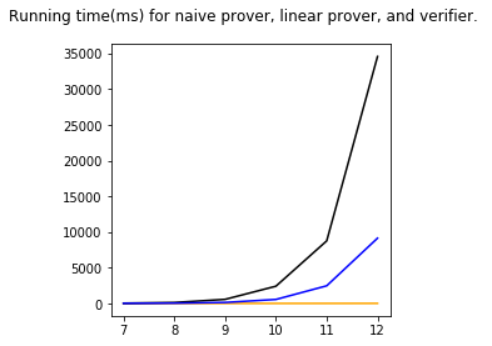

# Sumcheck protocol for Multilinear polynomials
A python implementation of sumcheck protocol for multilinear polynomial and product of multilinear polynomials (PMF). Sumcheck protocol is useful in interactive proofs (IP). 

## Getting Started

#### Represent a multilinear polynomial

Each multilinear polynomial is an instance of `MVLinear` class. We need to specify the number of variables in the polynomial, the coefficient of each monomial, and the size of the finite field of this polynomial. Example: 

```python
from polynomial import MVLinear
# P(x0, x1, x2, x3) = 15 + x0 + 4*x3 + x1*x2 + 5*x2*x3 (in Z_37)
P = MVLinear(4, {0b0000: 15, 0b0001: 1, 0b1000: 4, 0b0110: 1, 0b1100: 5}, 37)
```

The monomials are represented by a dictionary where the index is the binary form of the monomial: the least significant bit represents `x0`, second least significant bit represents `x1` and so on. The value represents the coefficient of the monomial. 

We can add, subtract, and multiply polynomials using python `+`, `-`, `*` operators. For multiplication, if the result polynomial is no longer multilinear, an `ArithmeticError` will be raised. 

We can also use `makeLinearConstructor` to generate polynomials with same number of variables and field size quickly. This function takes `num_variables` and `p` (field size) and return a function that takes monomials and return the `MVLinear` instance. 

Examples for polynomial operations: 

```python
from polynomial import makeMVLinearConstructor
m = makeMVLinearConstructor(4, 37)
x0 = m({0b1: 1})
x1 = m({0b10: 1})
x2 = m({0b100: 1})
x3 = m({0b1000: 4})
x4 = m({0b10000: 5})

p = 2*x2 + 3*x3 + 19
p2 = x1 + 7*x0*x1+ x0 + 8
p  # MVLinear( + 2*x2 + 12*x3 + 19)
p2  # MVLinear( + 1*x1 + 7*x0x1 + 1*x0 + 8)
p+p2 # MVLinear( + 2*x2 + 12*x3 + 27 + 1*x1 + 7*x0x1 + 1*x0)
p-p2 # MVLinear( + 2*x2 + 12*x3 + 11 + 36*x1 + 30*x0x1 + 36*x0)
p*p2  # MVLinear( + 2*x1x2 + 14*x0x1x2 + 2*x0x2 + 16*x2 + 12*x1x3 + 10*x0x1x3 + 12*x0x3 + 22*x3 + 19*x1 + 22*x0x1 + 19*x0 + 4)
p*p # ArithmeticError: no longer multilinear
```

#### Represent a product of multilinear polynomial (PMF)


### Initialize the Interactive Verifier

The constructor of the verifier takes `seed` (random source), `polynomial` (the multilinear polynomial to check), `asserted_sum` (the sum that the prover is going to prove). At the beginning, the verifier is not convinced. When the prover calls prove and send the verifier a univariate linear polynomial (represented by P(0) and P(1)), the verifier verifies the sum, sends a random value back, and goes to next round. 

Example: 

```python
from polynomial import makeMVLinearConstructor
from IPVerifier import InteractiveVerifier
m = makeMVLinearConstructor(4, 37)
x0 = m({0b1: 1})
x1 = m({0b10: 1})
x2 = m({0b100: 1})
x3 = m({0b1000: 4})
x4 = m({0b10000: 5})

p = 2*x0 + 3 * x1 + 3
v = InteractiveVerifier(12345, p, 22)  # v.active = True, v.convinced = False
v.talk(p(0,0)+p(0,1), p(1,0)+p(1,1))  # returns (True, 26), v.active = True, v.convinced = False
v.talk(p(26, 0), p(26, 1))  # returns (True, 0), v.active = False, v.convinced = True
# Verifier accepts the result
```

Example for PMF (Product of Multilinear polynomial) Verifier:
```python
from polynomial import makeMVLinearConstructor
from IPPMFVerifier import InteractivePMFVerifier

m = makeMVLinearConstructor(3, 199)
x0 = m({0b1: 1})
x1 = m({0b10: 1})
x2 = m({0b100: 1})

from PMF import PMF
p = PMF([x2*x1 + x0,x1*4 + x2*x1 + x0*x1])
v = InteractivePMFVerifier(12345, p, 22) 
p(0,0,0)+p(0,0,1)+p(0,1,0)+p(0,1,1)  # 5
p(1,0,0)+p(1,0,1)+p(1,1,0)+p(1,1,1)  # 17
p(2,0,0)+p(2,0,1)+p(2,1,0)+p(2,1,1)  # 33

v.talk([5,17,33])
p(106,0,0)+p(106,0,1)  # 0
p(106,1,0)+p(106,1,1)  # 254
p(106,2,0)+p(106,2,1)  # 133

v.talk([0, 254%199,133])
p(106,187,0)  # 176
p(106,187,1)  # 162
p(106,187,2)  # 38
v.talk([176,162,38])  # verifier convinced
```

### Interactive Prover
#### Interactive Prover for Multilinear polynomial
The interactive prover is represented by the `InteractiveLinearProver` class. 
The prover first precalculates the evaluations of polynomials on {0,1}^n and the sum of it. 
Then, the prover talks to the verifier interactively to convince the verifier about the sum. 
```python
from IPVerifier import InteractiveVerifier
from IPProverLinear import InteractiveLinearProver
from polynomial import randomMVLinear
from random import randint
# suppose we have a polynomial p
p = randomMVLinear(6)

# initialize the prover
pv = InteractiveLinearProver(p)
# calculate the book keeping table and sum
A, s = pv.calculateTable()

# initialize the verifier
v = InteractiveVerifier(randint(0xFFFFFFFF), p, s)

# convince the verifier
pv.attemptProve(A, v)
```  
#### Interactive Prover for PMF (Products of Multilinear Polynomials)
The interactive protocol for PMF is similar
```python
from IPPMFVerifier import InteractivePMFVerifier
from IPPMFProver import InteractivePMFProver
from polynomial import randomMVLinear
from random import randint
from PMF import PMF

# suppose we have a PMF p, which is the product of 5 multilinear polynomials with 5 variables
p = PMF([randomMVLinear(5) for _ in range(5)])

# initialize the prover
pv = InteractivePMFProver(p)
# calculate the book keeping tables and sum
As, s = pv.calculateAllBookKeepingTables()

# initialize the verifier
v = InteractivePMFVerifier(randint(0xFFFFFFFF), p, s)

# convince the verifier
pv.attemptProve(As, v)
```

### Offline Version of the protocol
Using Fiat-Shamir Transform, one can use a pseudorandom function to convert the interactive protocol offline. 
Note that this protocol requires larger field size, as the soundness error for the offline version is larger. 
In this implementation, the field size requirement is linear to number of rounds in interactive protocol, which is `number of variables + 1`.
#### Offline sum-check for Multilinear Polynomial
```python
from polynomial import randomMVLinear, randomPrime
from FSProver import generateTheoremAndProof
from FSVerifier import verifyProof

poly = randomMVLinear(12, randomPrime(32))  # generate a random 12-variable with 32-bit field size
generateTheoremAndProof(poly, 2e-64)  # generate the proof and check if soundness error requirement is met
# this is lead to an error
# IPVerifier.SoundnessErrorException: Soundness error 5.036415256650313e-08 exceeds maximum allowed soundness error 1.6666666666666665e-65
# Try to have a prime with size >= 224 bits

poly = randomMVLinear(12, randomPrime(224))
theorem,  proof = generateTheoremAndProof(poly, 2e-64)

verifyProof(theorem, proof, 2e-64)  # this should return True
``` 
#### Offline sum-check for PMF
```python
from polynomial import randomMVLinear, randomPrime
from PMF import PMF
from FSPMFProver import generateTheoremAndProof
from FSPMFVerifier import verifyProof

prime = randomPrime(256)
# create a random PMF with 10 variables and 10 multiplicands
poly = PMF([randomMVLinear(10, prime) for _ in range(10)])

theorem, proof, _ = generateTheoremAndProof(poly, 2e-64)
verifyProof(theorem, proof, 2e-64)
```

## Project Todo List
### Phase 1: Multilinear Polynomial
- Completed: A sparse representation and evaluation oracle for multilinear function. 
- Completed: An Interactive Verifier. 
- Completed: A naïve prover, taking O(n*2^n) time. 
- Completed: A faster prover using dynamic programming taking O(2^n) time. (Reference: Xie, Zhang, Zhang, Papamanthou, Song, 2019, https://eprint.iacr.org/2019/317.pdf)
- Completed: A non-interactive verifier using random oracle based on Flake-2b (using Fiat-Shamir Transform). 

### Phase 2: Product of Multilinear Polynomial
- Todo: Representation of Product of Multilinear Polynomial (PMF)
- Todo: An Interactive Verifier for PMF Sum
- Todo: A linear prover of PMF Sum
- Todo: Fiat-Shamir Transform


